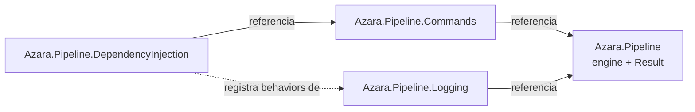
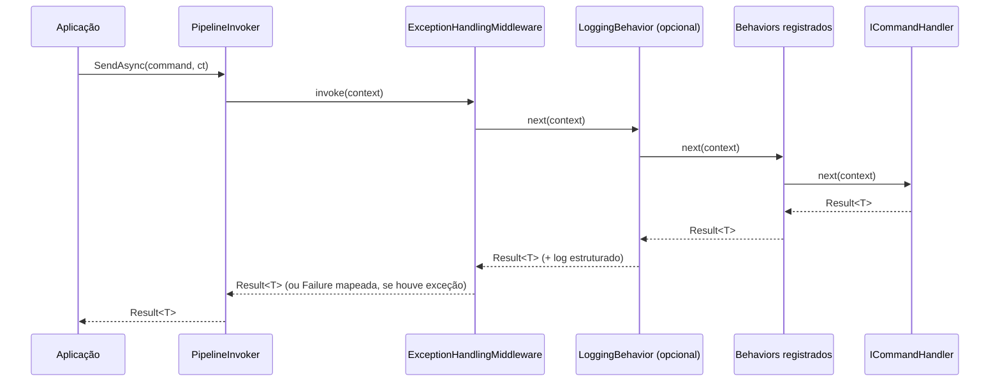

# Azara Pipeline — Documento de Arquitetura

**Status:** v0.1.0-preview em andamento — núcleo (engine de pipeline + Result pattern) implementado.
**Alvo:** .NET 10 · C# 13 · biblioteca open source, sem dependência de ASP.NET Core.

Este documento registra a arquitetura da **Azara Pipeline** e o racional de cada decisão técnica. É atualizado conforme a biblioteca evolui; mudanças de arquitetura relevantes também geram um ADR em [`docs/adr/`](adr/).

## Sumário

1. [Visão e princípios](#1-visão-e-princípios)
2. [Estrutura da solução](#2-estrutura-da-solução)
3. [Camadas e pacotes](#3-camadas-e-pacotes)
4. [Núcleo: contratos do pipeline](#4-núcleo-contratos-do-pipeline)
5. [Result pattern](#5-result-pattern)
6. [Camada de comandos](#6-camada-de-comandos)
7. [Fluxo de execução](#7-fluxo-de-execução)
8. [Tratamento global de exceções](#8-tratamento-global-de-exceções)
9. [CancellationToken — convenção adotada](#9-cancellationtoken--convenção-adotada)
10. [Logging opcional](#10-logging-opcional)
11. [Injeção de dependência](#11-injeção-de-dependência)
12. [Decisões técnicas e justificativas](#12-decisões-técnicas-e-justificativas)
13. [Estratégia de testes](#13-estratégia-de-testes)
14. [Estratégia de benchmarks](#14-estratégia-de-benchmarks)
15. [Empacotamento NuGet](#15-empacotamento-nuget)
16. [Roadmap de versões](#16-roadmap-de-versões)
17. [Estado atual](#17-estado-atual)

---

## 1. Visão e princípios

A Azara Pipeline generaliza o padrão de middleware do ASP.NET Core (`IApplicationBuilder` → `RequestDelegate`) para **qualquer** unidade de trabalho, não apenas requisições HTTP: comandos de aplicação, jobs de fila, etapas de ETL, handlers de mensagens. A ideia central do ASP.NET Core — uma cadeia de componentes que decide invocar `next()` ou curto-circuitar — é ótima e comprovada; o que falta no ecossistema é a mesma ergonomia **fora** do `Microsoft.AspNetCore.Http`.

Princípios que guiam toda decisão abaixo:

- **Núcleo sem dependências.** O pacote central não referencia nada além do BCL. Logging e DI são opt-in, em pacotes separados.
- **Falhas esperadas não são exceções.** Regras de negócio retornam `Result`/`Result<T>`; exceções são reservadas para falhas realmente inesperadas (bugs, I/O, infraestrutura).
- **Composição, não herança.** Middlewares e behaviors são interfaces pequenas; nada de classes base abstratas com estado escondido.
- **Performance é requisito, não otimização tardia.** A cadeia de execução é montada uma vez e cacheada; o caminho quente não usa reflexão nem aloca além do estritamente necessário.
- **API simples primeiro.** Um novo usuário deve conseguir escrever um handler e testá-lo em poucos minutos, sem entender o pipeline inteiro.

## 2. Estrutura da solução

```
AzaraPipeline.sln
├── src/
│   ├── Azara.Pipeline/                          # núcleo: engine + Result (zero deps) — implementado (v0.1)
│   ├── Azara.Pipeline.Commands/                 # ICommand/ICommandHandler/IPipelineBehavior — planejado (v0.2)
│   ├── Azara.Pipeline.Logging/                  # integração com Microsoft.Extensions.Logging — planejado (v0.3)
│   └── Azara.Pipeline.DependencyInjection/       # integração com Microsoft.Extensions.DependencyInjection — planejado (v0.3)
├── tests/
│   ├── Azara.Pipeline.Tests/                    # implementado (v0.1)
│   ├── Azara.Pipeline.Commands.Tests/
│   ├── Azara.Pipeline.Logging.Tests/
│   ├── Azara.Pipeline.DependencyInjection.Tests/
│   └── Azara.Pipeline.IntegrationTests/
├── benchmarks/
│   └── Azara.Pipeline.Benchmarks/               # BenchmarkDotNet — planejado (v0.4)
├── samples/
│   ├── Samples.ConsoleApp.Pipeline/             # implementado (v0.1)
│   ├── Samples.MinimalApi/                      # planejado (v0.4)
│   └── Samples.WorkerService/                   # planejado (v0.4)
├── Directory.Build.props                        # metadata comum, nullable, langversion
├── Directory.Packages.props                      # central package management
├── LICENSE
└── docs/
    ├── architecture.md                          # este documento
    └── adr/                                      # Architecture Decision Records
```

## 3. Camadas e pacotes

| Pacote | Responsabilidade | Depende de | Status |
|---|---|---|---|
| `Azara.Pipeline` | Engine genérica de pipeline (`PipelineBuilder`, `IPipelineMiddleware`), `Result`/`Result<T>`/`Error` | BCL apenas | ✅ v0.1 |
| `Azara.Pipeline.Commands` | Açúcar sintático de comando/handler/behavior sobre a engine core (estilo request/response) | `Azara.Pipeline` | planejado v0.2 |
| `Azara.Pipeline.Logging` | `LoggingBehavior`, mensagens estruturadas via `LoggerMessage` source generator | `Azara.Pipeline`, `Microsoft.Extensions.Logging.Abstractions` | planejado v0.3 |
| `Azara.Pipeline.DependencyInjection` | `AddAzaraPipeline(...)`, descoberta de handlers/behaviors por assembly scanning | `Azara.Pipeline.Commands`, `Microsoft.Extensions.DependencyInjection.Abstractions` | planejado v0.3 |

Por que `Azara.Pipeline.Commands` é um pacote separado do núcleo: nem todo consumidor quer o vocabulário de "comando/handler" (que remete a CQRS). Alguém que só precisa encadear etapas de validação ou transformação de dados usa a engine crua do `Azara.Pipeline` sem herdar esse vocabulário. Separar em pacotes evita forçar uma opinião de modelagem em quem só quer a primitiva de composição.

Só as bibliotecas `*.Abstractions` da Microsoft são referenciadas — nunca o stack de hosting completo — para que `Logging` e `DependencyInjection` continuem leves e não puxem `Microsoft.Extensions.Hosting` para dentro de aplicações que não o usam.



## 4. Núcleo: contratos do pipeline

A camada mais baixa é deliberadamente pequena — três peças, no espírito de `RequestDelegate`/`IApplicationBuilder`. Implementação em [`src/Azara.Pipeline`](../src/Azara.Pipeline/):

```csharp
public interface IPipelineContext
{
    IDictionary<object, object?> Items { get; }
    CancellationToken CancellationToken { get; }
    IServiceProvider? Services { get; }
}

public delegate Task<Result> PipelineDelegate<TContext>(TContext context)
    where TContext : IPipelineContext;

public interface IPipelineMiddleware<TContext>
    where TContext : IPipelineContext
{
    Task<Result> InvokeAsync(TContext context, PipelineDelegate<TContext> next);
}

public sealed class PipelineBuilder<TContext>
    where TContext : IPipelineContext
{
    public PipelineBuilder<TContext> Use(
        Func<TContext, PipelineDelegate<TContext>, Task<Result>> middleware);

    public PipelineBuilder<TContext> Use(IPipelineMiddleware<TContext> middleware);

    public PipelineBuilder<TContext> Use<TMiddleware>()
        where TMiddleware : IPipelineMiddleware<TContext>, new();

    public PipelineDelegate<TContext> Build(PipelineDelegate<TContext> terminal);
}
```

`PipelineBuilder<TContext>.Build(...)` produz um `PipelineDelegate<TContext>` imutável — equivalente ao `RequestDelegate` compilado pelo `IApplicationBuilder.Build()`. Esse delegate é seguro para cache e reuso entre chamadas e threads, porque nada nele muda depois de construído.

`IPipelineContext.Items` é o "saco de dados" por execução, equivalente ao `HttpContext.Items`: correlação, feature flags de execução, ou dados passados de um middleware para outro sem acoplar suas interfaces.

O pacote também inclui `PipelineContext`, uma implementação padrão de `IPipelineContext`, para que a engine seja usável direto, sem pacotes adicionais.

## 5. Result pattern

```csharp
public readonly record struct Error(
    string Code,
    string Message,
    IReadOnlyDictionary<string, object?>? Metadata = null)
{
    public static Error FromException(Exception ex) =>
        new("unhandled_exception", ex.Message);
}

public readonly struct Result
{
    public bool IsSuccess { get; }
    public bool IsCancelled { get; }
    public Error Error { get; }

    public static Result Success();
    public static Result Failure(Error error);
    public static Result Cancelled();
}

public readonly struct Result<T>
{
    public bool IsSuccess { get; }
    public bool IsCancelled { get; }
    public T Value { get; }
    public Error Error { get; }

    public static Result<T> Success(T value);
    public static Result<T> Failure(Error error);
    public static Result<T> Cancelled();
}
```

Pontos deliberados:

- `Result` e `Result<T>` são **`readonly struct`**, não classes. `Result` é criado em toda invocação de handler/behavior — é caminho quente. Uma struct evita alocação no caso comum de sucesso, o que importa sob carga (menos pressão de GC).
- `IsCancelled` é um terceiro estado, distinto de `IsSuccess`/falha. Cancelamento não é uma falha de negócio; misturar os dois obrigaria o chamador a inspecionar `Error.Code` para saber se foi cancelado, o que é frágil.
- `Error` é um `record struct` com `Code` + `Message` + `Metadata` livre — deliberadamente pequeno. Não modela hierarquia de tipos de erro (validação, not-found, etc.) no core; isso fica para os consumidores definirem `Code`s próprios, ou para um pacote de extensão futuro (`Azara.Pipeline.Validation`).
- `Value`/`Error` lançam `InvalidOperationException` se acessados no estado errado (ex.: `Error` em um `Result` de sucesso) — falha rápido e explícito em vez de retornar `default`/`null` silenciosamente.

## 6. Camada de comandos

> Planejado para v0.2 — ainda não implementado.

Sobre o núcleo, `Azara.Pipeline.Commands` oferecerá a ergonomia de comando/handler:

```csharp
public interface ICommand<TResult>;

public sealed class CommandContext : IPipelineContext { /* ... */ }

public interface ICommandHandler<TCommand, TResult>
    where TCommand : ICommand<TResult>
{
    Task<Result<TResult>> HandleAsync(TCommand command, CommandContext context);
}

public delegate Task<Result<TResult>> CommandHandlerDelegate<TResult>();

public interface IPipelineBehavior<TCommand, TResult>
    where TCommand : ICommand<TResult>
{
    Task<Result<TResult>> HandleAsync(
        TCommand command,
        CommandContext context,
        CommandHandlerDelegate<TResult> next);
}

public interface IPipelineInvoker
{
    Task<Result<TResult>> SendAsync<TResult>(
        ICommand<TResult> command,
        CancellationToken cancellationToken);
}
```

`IPipelineBehavior<TCommand, TResult>` é literalmente um `IPipelineMiddleware<TContext>` especializado para o par comando/resultado — a camada de comandos não reinventa a composição, só a tipa. O `IPipelineInvoker` resolverá, para cada `TCommand`, a lista de behaviors aplicáveis (globais + específicos) e o handler, montará a cadeia via `PipelineBuilder<CommandContext>` e **cacheará o delegate compilado por tipo de comando** em um `ConcurrentDictionary<Type, Delegate>`.

## 7. Fluxo de execução



Este fluxo completo (com `ExceptionHandlingMiddleware` e `LoggingBehavior`) entra em vigor a partir da v0.3. Na v0.1, a engine crua (`PipelineBuilder<TContext>`) já implementa a composição básica: `App → middlewares registrados → terminal`, sem a borda de exceção — ver [`samples/Samples.ConsoleApp.Pipeline`](../samples/Samples.ConsoleApp.Pipeline/Program.cs).

## 8. Tratamento global de exceções

> Planejado — ainda não implementado. Hoje, uma exceção lançada por qualquer middleware propaga sem tratamento até o chamador (ver sample).

```csharp
public interface IPipelineExceptionHandler<TContext>
    where TContext : IPipelineContext
{
    // retorna null se este handler não tratou a exceção;
    // o próximo handler registrado assume a decisão.
    ValueTask<Result?> TryHandleAsync(TContext context, Exception exception);
}

public enum ExceptionPolicy
{
    ConvertToFailure,   // default: mapeia para Result.Failure(Error.FromException)
    LogAndRethrow,       // loga e propaga — para infra que precisa ver a exceção crua
    Custom                // delega inteiramente à cadeia de IPipelineExceptionHandler
}
```

Isso espelha o `IExceptionHandler` introduzido no ASP.NET Core 8: uma cadeia de handlers plugáveis, resolvida por DI, em vez de um único `catch` monolítico. `OperationCanceledException` originada do `CancellationToken` do próprio contexto **não** passa por essa cadeia — é tratada à parte (seção 9), porque cancelamento não é uma falha a ser reportada como erro de negócio.

## 9. CancellationToken — convenção adotada

O `CancellationToken` vive em `IPipelineContext.CancellationToken` como fonte única de verdade — o mesmo modelo do `HttpContext.RequestAborted` no ASP.NET Core. `PipelineDelegate<TContext>` e `IPipelineMiddleware<TContext>.InvokeAsync` **não** recebem um `CancellationToken` separado: isso eliminaria a possibilidade de duas fontes divergentes (alguém passar um token diferente do que está no contexto). Ver [`docs/adr/0002-cancellationtoken-single-source.md`](adr/0002-cancellationtoken-single-source.md).

Cancelamento requisitado durante a execução gera `OperationCanceledException`. Até a v0.3 (quando o `ExceptionHandlingMiddleware` existir), essa exceção propaga sem tratamento — o handler final deve observar `context.CancellationToken` explicitamente (`ThrowIfCancellationRequested()`) e o chamador deve tratar `OperationCanceledException`. A partir da v0.3, ela será convertida para `Result.Cancelled()` antes de qualquer `IPipelineExceptionHandler` customizado.

## 10. Logging opcional

> Planejado para v0.3 — ainda não implementado.

`Azara.Pipeline.Logging` referenciará apenas `Microsoft.Extensions.Logging.Abstractions`. Sem esse pacote instalado, o core não sabe que logging existe — não há `#if` nem dependência condicional, é isolamento por pacote. `LoggingBehavior` usará `[LoggerMessage]` (source generator) em vez de interpolação de string, para evitar alocação quando o nível de log está desabilitado.

## 11. Injeção de dependência

> Planejado para v0.3 — ainda não implementado.

`Azara.Pipeline.DependencyInjection` fará scanning de assembly **apenas no startup**, nunca por chamada. `RegisterHandlersFrom` varrerá a assembly por implementações de `ICommandHandler<,>` e `IPipelineBehavior<,>`; o `PipelineInvoker` em runtime só resolverá tipos já conhecidos e cacheará a cadeia montada — não há reflexão por comando executado.

## 12. Decisões técnicas e justificativas

| Decisão | Alternativa considerada | Por que esta escolha |
|---|---|---|
| Delegate-chain compilado via `PipelineBuilder.Build()` | Resolver e montar a cadeia a cada execução | Montagem uma vez, reuso do delegate — igual ao `RequestDelegate` do ASP.NET Core |
| `Result`/`Result<T>` como `readonly struct` | `class` (como a maioria das libs de Result no NuGet) | `Result` é criado em todo handler/behavior — caminho quente. Struct evita alocação no caso de sucesso |
| Núcleo sem dependência de `Microsoft.Extensions.*` | Acoplar logging/DI diretamente no core, como muitas libs fazem | Mantém o pacote central pequeno, compatível com Native AOT/trimming, e sem risco de conflito de versão em quem consome |
| `CancellationToken` só via `context.CancellationToken` (sem parâmetro duplicado) | Assinatura convencional do BCL com `CancellationToken` como último parâmetro | Uma única fonte de verdade elimina divergência entre o token do contexto e um token passado à parte |
| `Azara.Pipeline.Commands` como pacote separado do core | Um único pacote com tudo | Quem só precisa da engine de middleware genérica não herda vocabulário de CQRS nem tipos que não usa |
| `net10.0` com Nullable/ImplicitUsings habilitados por padrão | Suportar múltiplos TFMs (net8/net9/net10) | Biblioteca nova, sem legado — mirar só na versão atual simplifica manutenção; multi-targeting pode ser revisitado se houver demanda |

## 13. Estratégia de testes

- **Unitários por pacote** (`xUnit` + `Shouldly`): cada middleware/behavior testado isoladamente com um `next` fake.
- **Testes de contrato da engine** (implementados em [`PipelineBuilderTests`](../tests/Azara.Pipeline.Tests/PipelineBuilderTests.cs)): ordem de registro respeitada, curto-circuito sem chamar `next()`, reuso do pipeline compilado entre execuções, exceção em uma execução não corrompe execuções seguintes.
- **Testes de `Result`/`Result<T>`** (implementados em [`ResultTests`](../tests/Azara.Pipeline.Tests/ResultTests.cs)): estados mutuamente exclusivos, acesso inválido lança `InvalidOperationException`, igualdade estrutural, conversão implícita.
- **Testes de integração** (`Azara.Pipeline.IntegrationTests`, planejado v0.3): cenário ponta a ponta com DI real.

## 14. Estratégia de benchmarks

> Planejado para v0.4.

Projeto `Azara.Pipeline.Benchmarks` com **BenchmarkDotNet** e `[MemoryDiagnoser]`, medindo overhead do pipeline vs. chamada direta, alocações por chamada, custo marginal por middleware adicional, e um comparativo informativo com MediatR.

## 15. Empacotamento NuGet

- **Licença:** MIT — `PackageLicenseExpression=MIT` via `Directory.Build.props`. Arquivo [`LICENSE`](../LICENSE) na raiz.
- **Central Package Management** via [`Directory.Packages.props`](../Directory.Packages.props).
- **Ícone e publicação real no NuGet.org:** adiados para a v0.9 (congelamento de API), junto com SourceLink, symbol packages e validação de trimming/AOT — ver roadmap.
- **Nomes de pacote:** `Azara.Pipeline`, `Azara.Pipeline.Commands`, `Azara.Pipeline.Logging`, `Azara.Pipeline.DependencyInjection`.

## 16. Roadmap de versões

| Versão | Escopo | Critério de saída | Status |
|---|---|---|---|
| **v0.1.0-preview** | Núcleo: `PipelineBuilder`, `IPipelineMiddleware`, `IPipelineContext`, `Result`/`Result<T>`/`Error` | Sample de console rodando um pipeline simples; testes unitários do core passando | ✅ concluído |
| **v0.2.0-preview** | Camada de comandos: `ICommand`, `ICommandHandler`, `IPipelineBehavior`, `PipelineInvoker` com cache de cadeia | Sample de processamento de pedidos com 2+ behaviors | próximo |
| **v0.3.0-preview** | `Azara.Pipeline.Logging` (LoggerMessage) + `Azara.Pipeline.DependencyInjection` (assembly scanning) + `ExceptionHandlingMiddleware` | Sample com DI completo + logging estruturado visível | planejado |
| **v0.4.0-preview** | Benchmarks publicados, hardening de performance, samples de Minimal API e Worker Service | Benchmark de overhead documentado; zero alocação no caminho feliz confirmada | planejado |
| **v0.9.0-rc** | Congelamento de API, XML docs completos, validação AOT/trimming, SourceLink, symbol packages, ícone, publicação NuGet.org | Revisão de breaking changes concluída; checklist de release fechado | planejado |
| **v1.0.0** | Release estável | Início do contrato de compatibilidade SemVer | planejado |
| **v1.x** | `Azara.Pipeline.Diagnostics` (OpenTelemetry), integração opcional de validação, middlewares prontos (Timeout via `TimeProvider`, Retry) | — | planejado |
| **v2.0** | Registro via source generator para Native AOT completo | — | planejado |

## 17. Estado atual

A v0.1.0-preview está implementada: os quatro tipos do núcleo, `Result`/`Result<T>`/`Error`, 17 testes unitários e um sample de console cobrindo sucesso, curto-circuito e cancelamento. Nenhuma decisão de arquitetura foi violada durante a implementação.

Próximo passo: v0.2.0-preview (`Azara.Pipeline.Commands`) — a ser escopada separadamente quando este trabalho for retomado.
